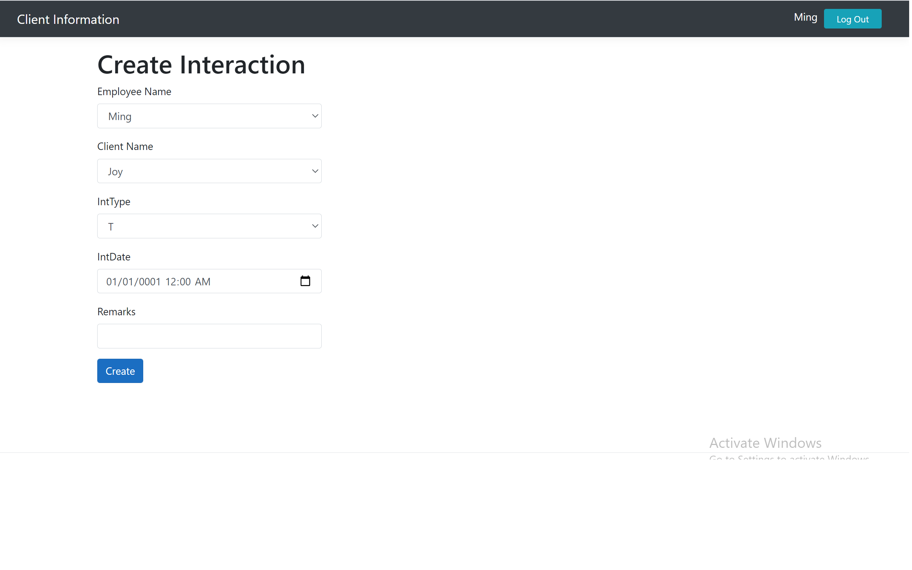
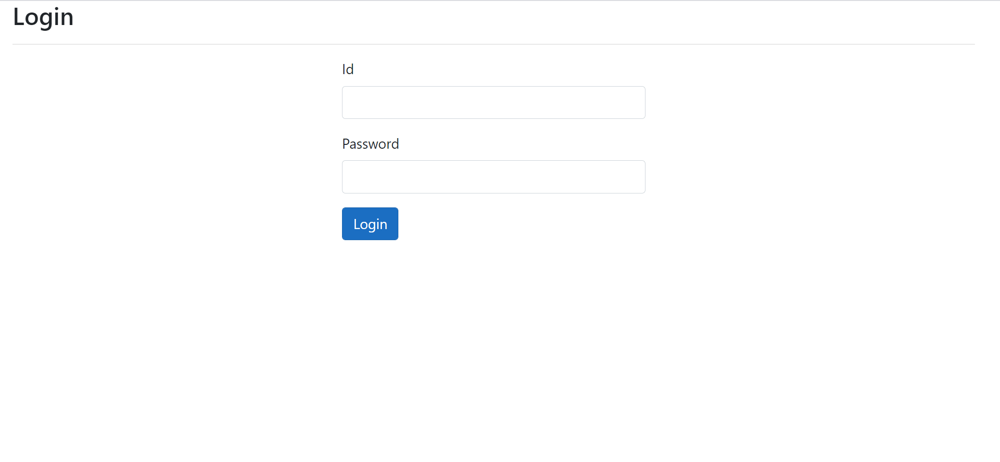
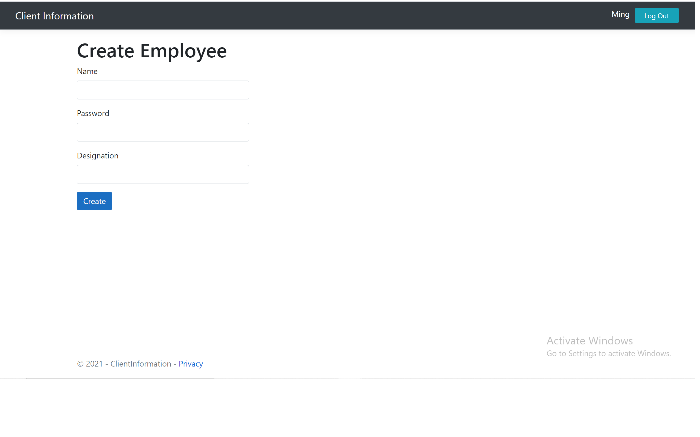
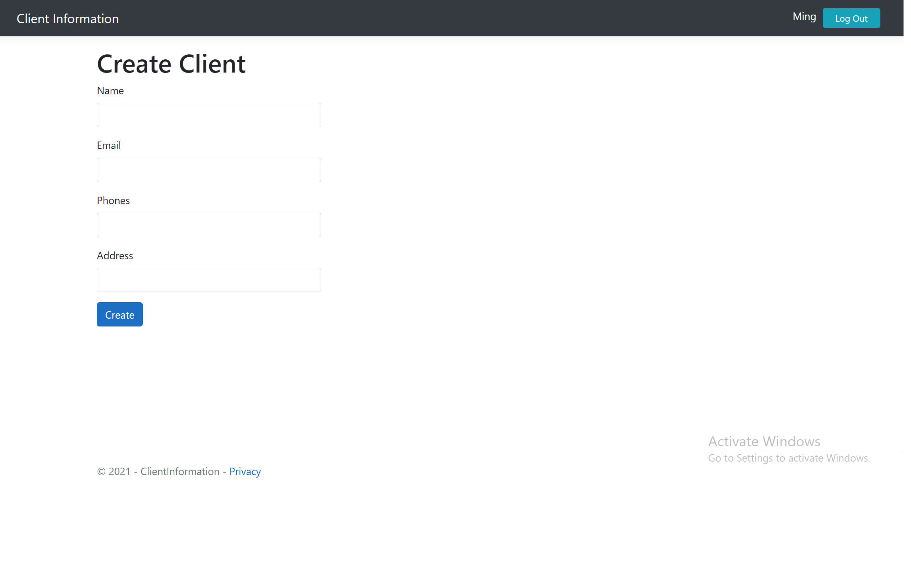
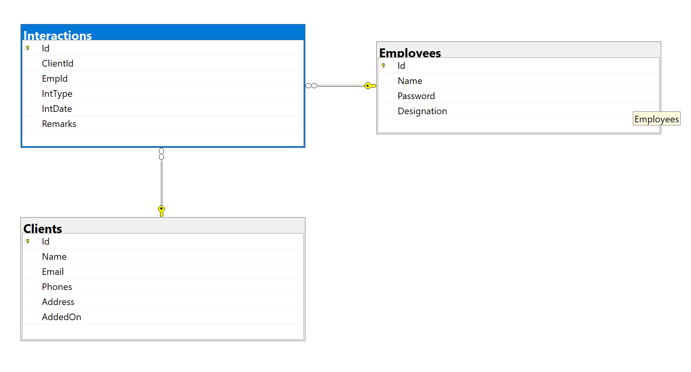

# Antra_Final_ClientInfoSystem
The system stores information about its clients and the interactions done with clients. I develop it with ASP .Net Core. Connect with the database by using Entity Framework Core. Also, creating and updating Database with EF Core Code First approach using migrations. The application include the register and login-in page, homepage, interaction page, etc. The business logic was implemented to extract the correct data and presented in the client side. Also this website contains the webpages, decorated by the BOOTSTRAP.

<li>The home page displays the dashboard of the Employees list and the Clients list.</li>
<li>The login page also has a cookie authentication to check if the time expired.</li>
<li>Employee name and Client name are clickable. The page will direct to the page that displays all the interaction that is related to the client or Employee. </li>

## Homepage 

## Login/Register

## Create Employee/Client/Interaction

## Database diagram

