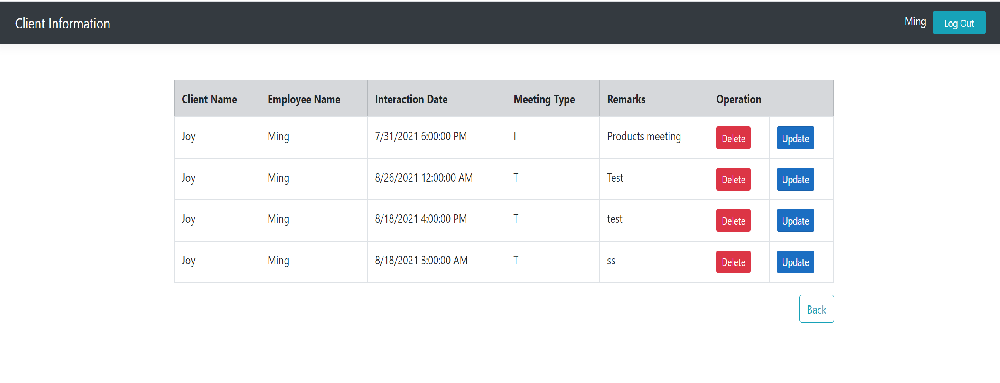

# Clients Information System
The system stores information about its clients and the interactions done with clients. I develop it with ASP .Net Core, and I connect it with the server by using Entity Framework Core. Also, I create and update database with EF Core Code First approach using migrations. The application include the register and login-in page, homepage, interaction page, etc. The business logic was implemented to extract the correct data and presented in the client side. Also this website contains the webpages, decorated by the BOOTSTRAP.

<li>The home page displays the dashboard of the employees list and the clients list.</li>
<li>The login page also has a cookie authentication to check if the time expired.</li>
<li>The employee name and the client name are clickable. The page will redirect to the page that displays all the interaction that is related to the client or Employee. </li>

## Homepage 

## Create Employee/Client/Interaction

## Update/ Delete Interaction by Employee

## Update/ Delete Interaction by Client

## Login/Register

## Database diagram

